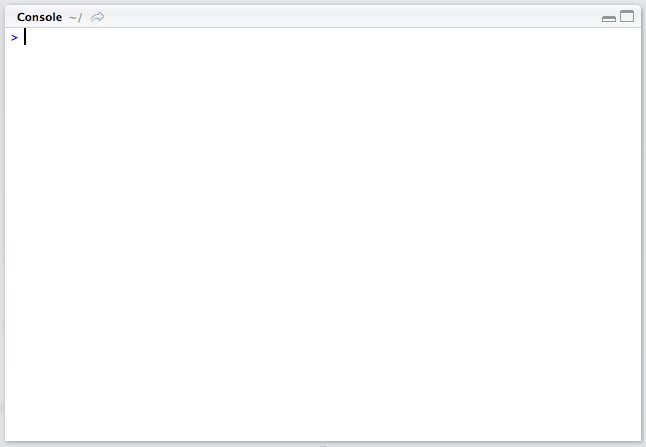

Now that you've installed R and RStudio you should open up RStudio. When you
open RStudio you will see three or four seperate window panes. One of these
panes is the R console, it should look something like this:



### The fancy calculator

When you type a line of code into the R console R will evaluate that line of
code and then R will perform some action. In its simplest form, R is a very
fancy calculator. Type `2 + 2` into the R console and then hit enter. Your
console should look something like this:

```
> 2 + 2
[1] 4
>
```

The `4` is the result of the *expression* `2 + 2`. In general R evaluates
expressions and either returns a value (in this case `4` is the value returned)
or R performs some action. Sometimes expressions return sequences of values
when an expression is evaluated, and the `[1]` before the `4` is letting you know that
the line of text that was printed to the console with the result starts with the
first member of the sequence. In this case the value is a "sequence" of one value
(the number `4`), so it's not much of a sequence at all.

Keep experimenting with the console as a calculator. You can add (`+`),
subtract (`-`), multiply (`*`), and divide (`/`) numbers. Here are some
examples:

```{r}
3 + 6
4 - 1
50 * 1.12
-8 / 2.5
```

Each grey box above is an R expression that you can type into the R console, and
each white box shows the result of that expression printed to the R console.

### Variables

Like with many fancy calculators you can assign values to variables and then
use those variables later. The "less than" symbol followed by a minus sign is
called the *assignment operator*, it looks like this: `<-`. The value on the
right hand side of the assignment operator is stored in the variable on the
left hand side of the assignment operator. Let's take a look at how this works:

```{r}
x <- 1
x + 3
x + x

negative_nine <- -9
negative_nine / 3
4 - negative_nine
negative_nine / negative_nine * x
```

You can use whatever variable names you like as long as they start with a letter
and only contain letters, numbers, periods, or underscores. A useful keyboard
shortcut for typing the assignment operator is `ALT` + `-`.

### Writing Scripts

In RStudio navigate to File -> New File -> R Script. This should open up a
new R Script. R code that you write inside of an R Script will be executed from
the first line to the last line. It's often useful to write lines of R code and
then to execute them selecting the line you wish to execute and then typing
`Command` + `Enter` on Mac or `Control` + `Enter` on Windows. Type the following
R code into an R script and try executing it line by line:

```{r, eval=FALSE}
5 + 9
3 - 40
4 * 7
0 * 100
```

---

### [Home](index.html)